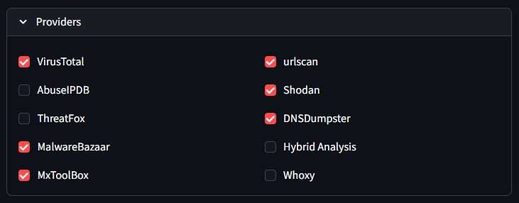
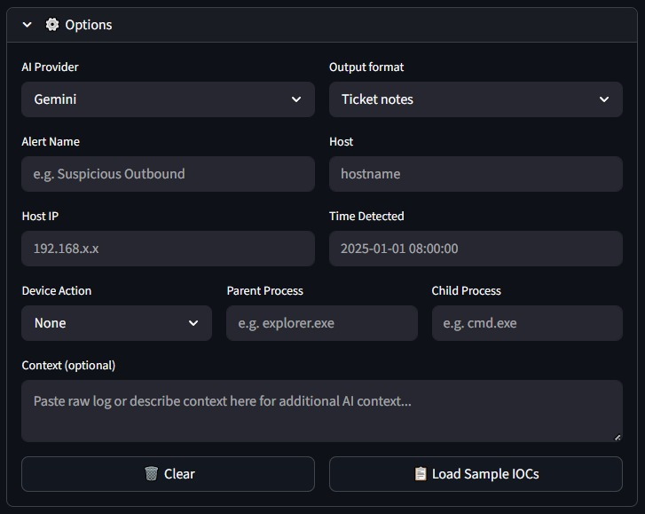
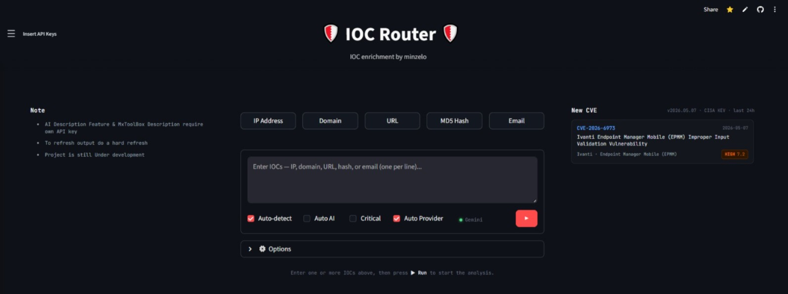

# IOC Router


[](https://minzelo-ioc-analyzer.streamlit.app)

IOC Router is a multi-source threat intelligence platform built for SOC analysts. Paste one or more suspicious indicators — IPs, domains, URLs, file hashes, emails, or bare keywords — and get an enriched verdict aggregated from up to 11 threat intel providers, complete with severity-rated flags, MITRE ATT&CK mappings, geolocation, and an AI-generated incident ticket.

Access from: [https://ioc-router.streamlit.app](https://ioc-router.streamlit.app)

---

## Features

### 1. Multi-source Enrichment

Queries up to 11 threat intelligence providers simultaneously — VirusTotal, URLScan, AbuseIPDB, Shodan, ThreatFox, MalwareBazaar, DNSDumpster, Hybrid Analysis, MxToolBox, Whoxy, and Ransomware.live. Each provider can be toggled individually, and results are displayed in a per-provider tabbed view showing detection scores, reputation data, and raw details from each source.

<p align="center">
  
  &nbsp;&nbsp;
  
</p>

---

### 2. IOC Type Auto-detection

Automatically identifies and routes each indicator to the relevant providers — supports IPv4/IPv6, domain, URL, file hash (MD5/SHA1/SHA256), email, and keywords. When **Auto-detect** and **Auto Provider** are enabled, mixed IOC types can be submitted together in one batch and the system handles classification and routing without manual configuration.

<p align="center">
  
</p>

<p align="center">
  
</p>

---

### 3. Threat Flag Extraction

Extracts 100+ granular threat flags from provider responses, each labeled with a severity level (CRITICAL, HIGH, MEDIUM, LOW) and mapped to MITRE ATT&CK technique IDs. Flags are grouped by severity in collapsible sections, making it easy to triage the most critical indicators first.

<p align="center">
  
</p>

---

### 4. Verdict Aggregation

Produces a final verdict per IOC — **Malicious**, **Suspicious**, **Unknown**, or **Benign** — based on consensus across all queried providers. The ticket notes output includes a session-level summary (total IOCs, count per verdict) followed by a per-IOC breakdown listing each provider's finding and a plain-language conclusion.

<p align="center">
  
</p>

---

### 5. Threat State & Level

Determines the threat lifecycle state (e.g. Reconnaissance, Persistence, Impact) and assigns a threat level (Low → Very High), adjusted for asset criticality when the **Critical** flag is set. Also surfaces a human-readable risk label, a list of reasons driving the assessment, all relevant MITRE ATT&CK tactics observed across providers, key evidence per IOC (malware family, domain age, open ports, first seen), and direct source links back to each provider's result page.

<p align="center">
  
  &nbsp;&nbsp;
  
</p>

<p align="center">
  
  &nbsp;&nbsp;
  
</p>

---

### 6. Geolocation & Mapping

Resolves IP addresses to country, city, ISP, and ASN, and plots them on an interactive OpenStreetMap map embedded in the result card. Geolocation context is also surfaced in the key evidence and ticket note outputs alongside other per-IOC metadata.

---

### 7. AI Ticket Generation

Auto-generates a human-readable incident narrative using Google Gemini or Groq, grounded in the extracted flags, raw provider logs, and analyst-supplied context (alert name, host, host IP, detection time, device action, parent/child process, and free-text context). The AI provider and model can be selected via the Options panel before running the analysis.

<p align="center">
  
  &nbsp;&nbsp;
  
</p>

---

### 8. Multiple Output Formats

Results can be exported in four formats selectable from the Options panel — **Ticket Notes** (structured plain text per IOC, paste-ready for SIEM tickets), **Table** (tabular view with verdict, confidence, evidence, and sources), **JSON** (raw structured output for downstream processing), and **Shareable Text** (Base64-encoded summary, copy-to-clipboard ready).

<p align="center">
  
</p>

---

## Supported IOC Types

| Type | Examples |
|------|---------|
| IPv4 / IPv6 | `192.168.1.1`, `2001:db8::1` |
| Domain | `malicious-site.com` |
| URL | `http://phishing.example.com/login` |
| File Hash | MD5, SHA1, SHA256 |
| Email | `attacker@domain.com` |
| Keyword | `evilcorp` — triggers Whoxy reverse WHOIS by keyword |

---

## Threat Intelligence Providers

| Provider | Supported IOCs | Key Data |
|----------|---------------|----------|
| [**VirusTotal**](docs/virustotal.md) | IP, Domain, URL, Hash | 70+ AV engine results, YARA/SIGMA hits, sandbox behavior, reputation |
| [**URLScan.io**](docs/urlscan.md) | URL, Domain | Screenshot, redirect chain, credential form detection, obfuscation |
| [**AbuseIPDB**](docs/abuseipdb.md) | IP, Domain, URL | Abuse confidence score, report categories (DDoS, SSH brute force, phishing, etc.) |
| [**Shodan**](docs/shodan.md) | IP | Open ports, CVEs, service tags (tor, vpn, honeypot, etc.) |
| [**ThreatFox**](docs/threatfox.md) | IP, Domain, URL, Hash | Malware family, C2 infrastructure, confidence level |
| [**MalwareBazaar**](docs/malwarebazaar.md) | Hash | File signature, type, YARA rules, known sample metadata |
| [**DNSDumpster**](docs/dnsdumpster.md) | Domain, URL | Subdomains, A/MX/NS records, SPF configuration |
| [**Hybrid Analysis**](docs/hybrid_analysis.md) | IP, Domain, URL, Hash | Sandbox verdict, threat score, malware family, network IOCs, MITRE behavior |
| [**MxToolBox**](docs/mxtoolbox.md) | IP, Domain, URL, Email | Blacklist checks, PTR/MX/DNS/SPF/DMARC lookups, HTTP reachability, mail security posture |
| [**Whoxy**](docs/whoxy.md) | Domain, URL, Keyword | WHOIS registration data, registrant email/company, reverse WHOIS by registrant or keyword |
| [**Ransomware.live**](docs/ransomware_live.md) | Domain, URL, Keyword | Victim database search — ransomware group, incident date, breach records from dark-web leak sites |

---

## Analysis Pipeline

```
Input IOCs
    ↓
[Parser]          — type detection, normalization, deduplication
    ↓
[Provider Router] — each IOC is sent only to relevant providers
    ↓
[Flag Extraction] — 100+ threat flags extracted, severity-rated, MITRE-mapped
    ↓
[Verdict Engine]  — multi-source aggregation → Malicious / Suspicious / Unknown / Benign
    ↓
[Threat Analysis] — threat state + level, asset criticality adjustment
    ↓
[Geolocation]     — IP → geo coordinates → interactive map
    ↓
[AI Generation]   — Gemini / Groq generates an incident ticket narrative
    ↓
Output (Notes / Table / JSON / Shareable Text)
```

---

## Output Formats

| Format | Description |
|--------|-------------|
| **Ticket Notes** | Structured human-readable text per IOC — suitable for copy-paste into SIEM tickets |
| **Table** | Tabular view with artifact, type, verdict, confidence, evidence, and sources |
| **JSON** | Raw structured output for downstream processing or logging |
| **Shareable Text** | Base64-encoded summary, copy-to-clipboard ready |

---

## Project Structure

```
ioc-router/
├── app.py                        # Streamlit entry point
├── config.py                     # API key config & environment loading
├── requirements.txt
│
├── core/                         # Orchestration & shared utilities
│   ├── orchestrator.py           # Async provider dispatch & result aggregation
│   ├── cache.py                  # In-memory result caching
│   └── geo.py                    # IP geolocation resolution
│
├── ioc/                          # IOC processing pipeline
│   ├── parser.py                 # Type detection, normalization, deduplication
│   ├── verdict.py                # Multi-source verdict aggregation engine
│   ├── threat_analysis.py        # Threat state, threat level, asset criticality
│   └── flags/                    # Per-provider threat flag extractors
│       ├── virustotal.py
│       ├── urlscan.py
│       ├── abuseipdb.py
│       ├── shodan.py
│       ├── threatfox.py
│       ├── malwarebazaar.py
│       ├── hybrid_analysis.py
│       ├── dnsdumpster.py
│       ├── multisource.py        # Cross-provider correlation flags
│       ├── ransomware_live.py    # Ransomware.live victim flags
│       └── base.py               # Shared flag builder helpers
│
├── providers/                    # Provider API clients
│   ├── virustotal.py
│   ├── urlscan.py
│   ├── abuseipdb.py
│   ├── shodan.py
│   ├── threatfox.py
│   ├── malwarebazaar.py
│   ├── hybrid_analysis.py
│   ├── dnsdumpster.py
│   ├── mxtoolbox.py              # MxToolBox DNS/blacklist/mail lookups
│   ├── whoxy.py                  # Whoxy WHOIS + reverse WHOIS
│   ├── ransomware_live.py        # Ransomware.live victim search
│   ├── gemini.py                 # Google Gemini AI client
│   └── groq.py                   # Groq AI client
│
├── ui/                           # Streamlit UI components
│   ├── styles.py                 # Global CSS & theme
│   └── components/
│       ├── drawer.py             # API key drawer sidebar
│       ├── ioc_card.py           # Per-IOC result card
│       ├── ai_panel.py           # AI ticket generation panel
│       ├── cve_panel.py          # CVE details panel
│       ├── map.py                # Interactive OSM map builder
│       └── output_renderer.py    # Notes / Table / JSON / Shareable output
│
├── docs/                         # Provider integration documentation
│   ├── virustotal.md
│   ├── urlscan.md
│   ├── abuseipdb.md
│   ├── shodan.md
│   ├── threatfox.md
│   ├── malwarebazaar.md
│   ├── hybrid_analysis.md
│   ├── dnsdumpster.md
│   ├── mxtoolbox.md
│   ├── whoxy.md
│   ├── ransomware_live.md
│   ├── gemini.md
│   └── grok.md
│
├── image/                        # Screenshots for README documentation
│   ├── Homepage.jpeg
│   ├── Providers.jpeg
│   ├── Options.jpeg
│   ├── Ticket note ready output.jpeg
│   ├── AI Description result.jpeg
│   ├── Threat Analysis 1.jpeg
│   ├── Threat Analysis 2.jpeg
│   ├── Threat Analysis 3.jpeg
│   ├── Threat Analysis 4.jpeg
│   ├── Multiple diffrent IOC with Auto IOC detector and Auto Provider choose.jpeg
│   ├── multiple IOC results.jpeg
│   └── multiple provider output.jpeg
│
└── tests/
    ├── test_abuseipdb_processing.py
    ├── test_dnsdumpster_processing.py
    ├── test_hybrid_analysis_provider.py
    ├── test_malwarebazaar_provider.py
    ├── test_shodan_internetdb.py
    ├── test_threat_analysis.py
    └── test_urlscan_processing.py
```

---

## Requirements

- Python 3.10 or higher
- pip
- API keys for the providers you want to use (at minimum `VT_KEY` is recommended)

Install dependencies:

```bash
pip install -r requirements.txt
```

---

## Getting Started

### 1. Clone the repository

```bash
git clone https://github.com/your-username/ioc-router.git
cd ioc-router
```

### 2. Configure API keys

Create a `.env` file in the project root:

```env
VT_KEY=your_virustotal_key
URLSCAN_KEY=your_urlscan_key
ABUSEIPDB_KEY=your_abuseipdb_key
SHODAN_KEY=your_shodan_key
THREATFOX_KEY=your_threatfox_key
MALWAREBAZAAR_KEY=your_malwarebazaar_key
DNSDUMPSTER_KEY=your_dnsdumpster_key
HYBRID_ANALYSIS_KEY=your_hybrid_analysis_key
MXTOOLBOX_KEY=your_mxtoolbox_key
WHOXY_KEY=your_whoxy_key
RANSOMWARE_LIVE_KEY=your_ransomware_live_key
GEMINI_KEY=your_gemini_key
GEMINI_KEY_BACKUP=your_gemini_backup_key          # optional
GEMINI_MODEL=gemini-2.5-flash                     # optional, this is the default
GEMINI_API_VERSION=v1                             # optional, this is the default
GROQ_KEY=your_groq_key
```

> API keys can also be entered directly in the app UI via the key drawer — they are stored in session only and never written to disk.

### 3. Run the app

```bash
streamlit run app.py
```

The app will be available at:

```
http://localhost:8501
```
